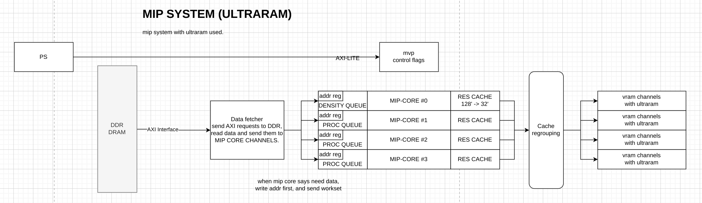
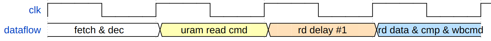
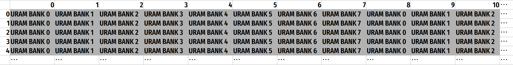
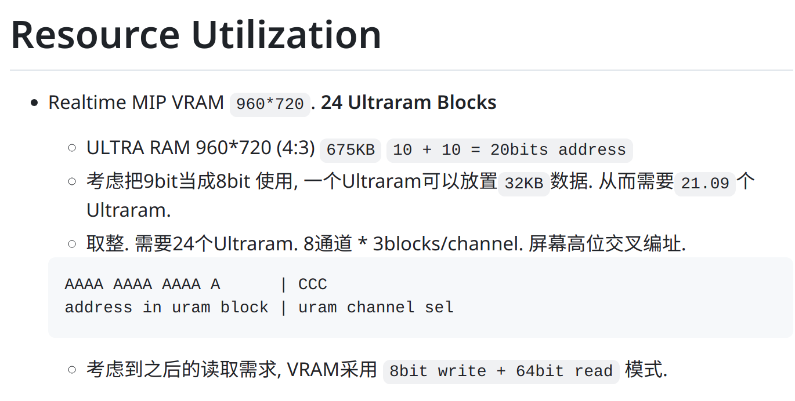
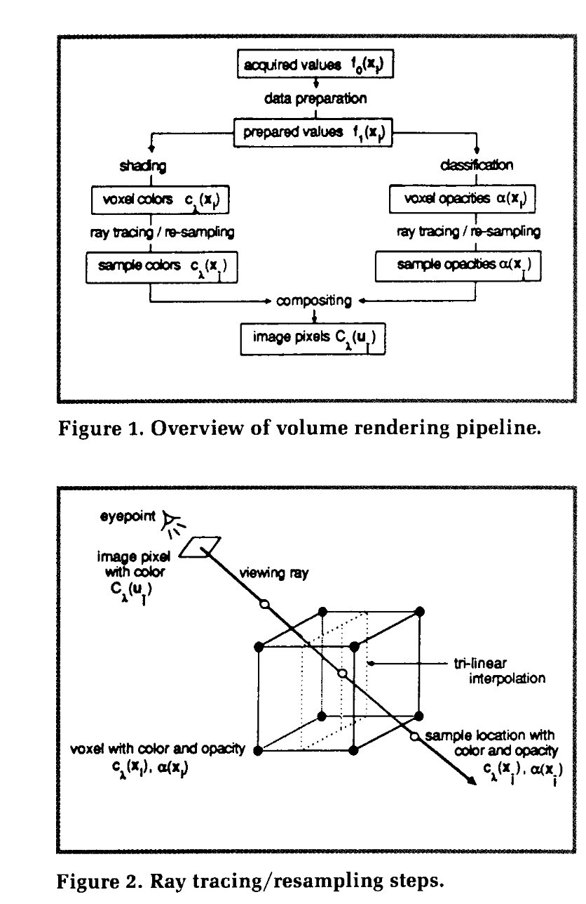

# 系统功能设计

## 系统框架设计
硬件系统将KV260开发板作为目标平台设计. KV260是基于Zynq Ultrascale+ MPSoC和K26 SOM的开发板, 具有强大的计算能力和丰富的外设资源. 本系统的设计目标是一个可扩展的, 低功耗的, 实时性强的面向手术机器人和医学教学等用途的医学影像系统. 系统设计包含PS和PL两部分, PS部分运行Linux, 用于应用的运行和最终的显示管理; PL部分实现图像渲染等并行性能需求高的任务, 通过AXI总线与PS部分通信. 

目前我们的设计围绕两套渲染系统展开: 一套实时MIP (Maximum Intensity Projection)系统和一套离线VR (Volume Rendering)系统. MIP系统用于高实时性的影像显示, 适用于手术机器人等对实时性要求高的场景; VR系统用于高质量的离线影像渲染, 适用于医学教学等对图像质量要求高的场景.

我们在设计中使用了Chisel语言用于PL部分的硬件生成. Chisel是一种硬件设计语言, 它是Scala语言的一个库, 可以生成Verilog代码. Chisel的优势在于它的高层次抽象, 可以方便的生成复杂的硬件结构. 我们的设计中使用了Chisel生成的硬件模块, 用于图像渲染和数据处理. Chisel的使用大大增加了代码的可读性和可维护性, 并且可以进行方便的参数化处理.

### MIP系统

MIP系统的框图如下. 在Linux系统中有一块预留内存, 用于存储图像数据, 该区域称为Texture Memory. Texture Memory中的数据由Linux系统从文件系统中读取. PL部分的MIP模块负责从Texture Memory中读取数据, 并进行MIP算法的计算, 最终将结果输出到显示设备.

首先Datafetch模块从Texture Memory中读取数据, 并将数据传递给MIP模块. Fetch模块使用了Xilinx DataMover IP, 用于高效的数据传输. 从Datamover读取的数据被暂存在Dispatch FIFO中. 根据下一级的Processing queue的状态, dispatch单元会将数据分配给并行的MIP-Channel. MIP-Channel中有4个MIP-Unit, 用于并行计算. MIP-Unit的输出被合并到一个输出队列中. 

与Ray-trace相关的MIP不同, 这里为了系统实时性和减少访存瓶颈, 我们使用了一种反向的MIP算法. 图形变换所需要的base position和MVP Matrix等参数由CPU计算, 并通过AXI-Lite控制总线传递给PL控制部分.

反向MIP的过程类似于光栅化, 从空间位置反向计算出对应的纹理坐标, 并从纹理坐标中读取数据. 

MIP-Unit通过多级流水线和浮点IP实现了高吞吐量的数据处理. 计算出对应的屏幕空间 (raster space) 坐标后, 数据进入最后一级compare pipeline, 用于计算MIP值. VRAM通过Ultraram实现, 用于存储结果和最终显示. 

值得注意的是最终compare pipeline的缓存设计. 前面的流水线每周期最多能产生16个结果, 且屏幕坐标可能不好预测, 然而uram最多能提供两个读写端口, 这导致我们需要一个支持多读多写的VRAM端口设计.

为了达成这个目的, 我们对URAM做了高位交叉编址, 使得同一时间可以有多个读写操作. 高位交叉编址还有一个好处: 相邻的像素会分布在不同的URAM bank中, 这样可以减少bank冲突, 提高吞吐量.

并且在读取的时候, 可以将8个VRAM通道的数据合并到一个64bit的数据中, 这样可以减少读取的次数, 提高效率.

### VR系统

VR系统目前只支持离线渲染, 后期会进行更多的硬件优化. Volume Rendering的实现参考了论文 Display of Surfaces from Volume Data (Marc Levoy, 1988, University of North Carolina) 的工作. 通过梯度计算, 光线追踪和采样, 着色和透明度分类等步骤, 最终得到了高质量的, 基于体积数据的面绘制结果. 下面的图来自于论文中的figure, 展示了渲染管线和ray tracing的过程.

着色采用Phong光照模型, 透明度分类采用了基于密度的方法. Phong着色模型和透明度分类的公式列举如下, 由于模型公开且论文有详细的描述, 这里不再赘述.

$$c_{\lambda}(\mathbf{x_{i}})=c_{p,\lambda}k_{a,\lambda}+\\\frac{c_{p,\lambda}}{k_1+k_2d\left(\mathbf{x_i}\right)}\left[k_{d,\lambda}(\mathbf{N}(\mathbf{x_i})\cdot\mathbf{L})+k_{s,\lambda}(\mathbf{N}(\mathbf{x_i})\cdot\mathbf{H})^n\right]$$

我们的工作使用的Phong光照模型为了简便没有考虑最后一项 specular reflection, 即高光反射, 仅考虑了ambient和diffuse (环境光漫射和直接光照漫反射) 两项.

透明度分类模型考虑了不同密度和梯度的影响, 将梯度变化较大的区域设置为不透明, 并且通过不同的阈值将密度不同的区域渲染出来. 例如, 对于CT数据, 骨头和软组织的密度差异较大, 较小的阈值可以用来渲染软组织, 较大的阈值可以用来渲染骨头. 关于透明度分类的详细描述可以参考论文中 Region Boundary Surfaces 部分. 

$$\begin{aligned}\alpha(\mathbf{x_i})&=|\nabla f\left(\mathbf{x_i}\right)| \left\{\begin{array}{c}\alpha_{\nu_{n+1}}\left[\frac{f\left(\mathbf{x_i}\right)-f_{\nu_n}}{f_{\nu_{n+1}}-f_{\nu_n}}\right]+\\\\\alpha_{\nu_n}\left[\frac{f_{\nu_{n+1}}-f\left(\mathbf{x_i}\right)}{f_{\nu_{n+1}}-f_{\nu_n}}\right]\text{, if}\ f(\mathbf{x_i})\in (f_{\nu_n}, f_{\nu_{n+1}})\\\\0&\text{otherwise}\end{array}\right.\end{aligned}$$

<!-- 三、实验测试	5
3.1、测试平台搭建	5
3.2、基础功能测试	5
3.3、拓展功能测试 -->

# 实验测试

## 测试平台搭建

### 仿真测试平台

仿真测试基于Verilator搭建. Verilator是一个开源的Verilog模拟器, 可以将Verilog代码转换为C++代码, 并通过C++代码进行功能验证. 我们单独对不同的模块进行了功能验证, 并通过仿真测试验证了模块的正确性, 减少了后续整合出现的问题.

### 硬件测试平台

我们的测试平台是KV260开发板, 该开发板基于Xilinx Zynq Ultrascale+ MPSoC, 具有强大的计算能力和丰富的外设资源. 我们的系统运行在KV260开发板上, 通过HDMI/DP接口输出图像.

代码基于SDL2库, 用于图形显示和输入. 代码通过OpenCV库读取图像数据, 并将数据传递给Texture Memory. 随后系统控制MIP模块进行计算, 并将结果输出到VRAM. 最终SDL2库从VRAM中读取数据, 并将数据输出到显示设备.

## 基础功能测试

1. MIP系统测试. 通过输入(键盘/手柄)事件控制SDL, CPU计算MVP Matrix等参数, 并通过AXI-Lite控制总线传递给PL控制部分. PL部分计算MIP值, 并将结果输出到VRAM. 最终SDL2库从VRAM中读取数据, 并将数据输出到显示设备.

2. VR系统测试. 目前体积渲染只能做到离线渲染. 在CPU发出指令后, 按照相关的摄像机信息进行路径追踪和管线进行渲染, 着色, 合成. 最终结果输出到VRAM, 并通过SDL2库输出到显示设备.